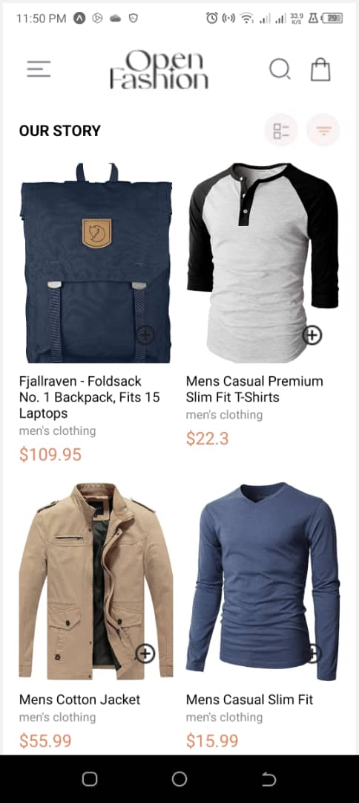
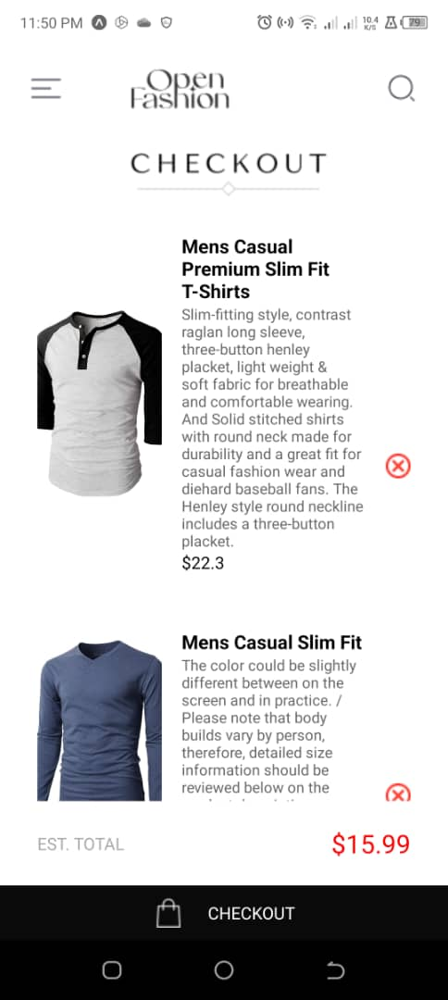
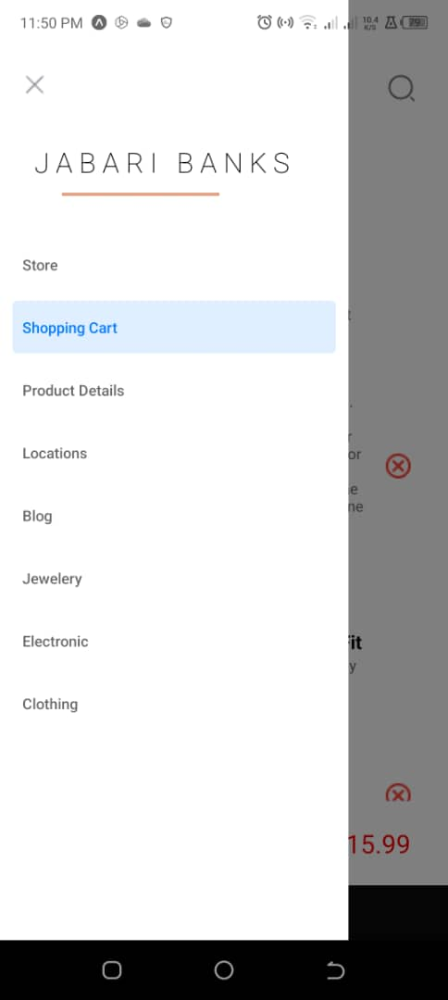
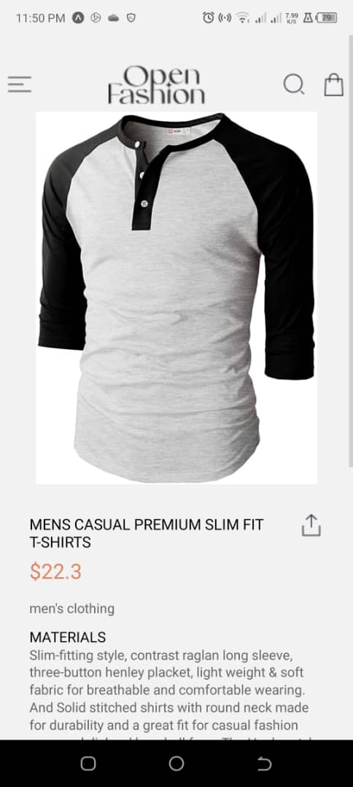
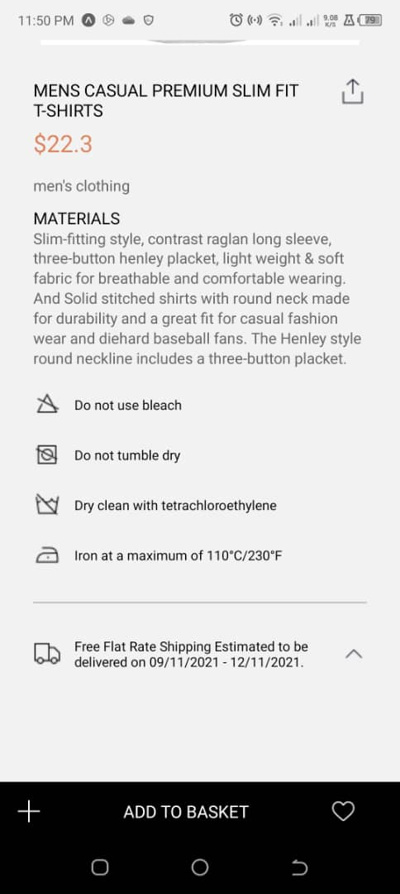

# rn-assignment6-11357610
Data Storage in Expo - Practice

### Design Choices and Why?
- Chose AsyncStorage because there isn't a high need to encrypt data (data of some selected Available Products)

### App Structure and Functionality
The app is built using React Native and Expo, with the following main components:

1. **App.js**: This is the entry point of the app. It sets up the navigation structure using React Navigation's `NavigationContainer` and `createDrawerNavigator`. The `MyDrawer` component renders the drawer navigation with two screens: `HomeScreen` and `CartScreen`.

2. **HomeScreen.js**: This component displays a list of available products. Each product is represented by an image, name, and price. Users can add products to their cart by clicking the "Add to Cart" button.

3. **CartScreen.js**: This component displays the items added to the cart. It fetches the cart data from AsyncStorage using the `useEffect` hook and the `getAllKeys` and `multiGet` methods. The cart items are displayed in a scrollable list, along with the total price calculated by summing up the prices of all items in the cart.

4. **imagePaths.js**: This file exports an object containing the paths to the product images used in the app.

### How Was Data Storage Implemented
- Using AsyncStorage, the app stores the selected products in the cart as key-value pairs. The key is prefixed with `@cart_` and the value is a JSON string representing the product details (name, price, image).
- When a user adds a product to the cart, the app generates a unique key (e.g., `@cart_1`) and stores the product details as a JSON string using `AsyncStorage.setItem`.
- On the `CartScreen`, the app retrieves all keys starting with `@cart_` using `AsyncStorage.getAllKeys`, then fetches the corresponding values using `AsyncStorage.multiGet`. These values are parsed as JSON and used to populate the cart list.
- The total price is calculated by summing up the prices of all cart items.

### Screenshots of the app on Android

### Steps Taken In Development
- Cloned created repo
- Created blank Expo app
- Installed required modules
- Implemented Drawer Navigation
- HomeScreen
  - Structure
  - Style
  - Link menu button to handle Drawer navigation
  - Take out the Drawer's Header
  - Working shopping bag icon - linked to CartScreen
  - Closer Styling
- CartScreen
  - Structure
  - Working Navigation
  - Closer Styling
- AsyncStorage Service
  - Implemented functions to add, remove, and retrieve cart items from AsyncStorage
  - Used `useEffect` hook to fetch cart items on component mount
  - Calculated total price based on cart items
- Add to Cart button with logic -- AsyncStorage
- Close Styling
- Testing
- Submit

### Running the App
1. Clone the repository: `git clone https://github.com/your-username/rn-assignment6-11357610.git`
2. Install dependencies: `npm install`
3. Start the Expo development server: `expo start`
4. Use the Expo app on your Android device to run the app, or use an Android emulator.

### Corrections
If you have any positive criticism, kindly get in touch. 
Thank you.
