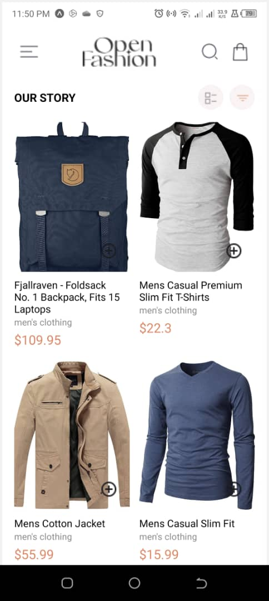
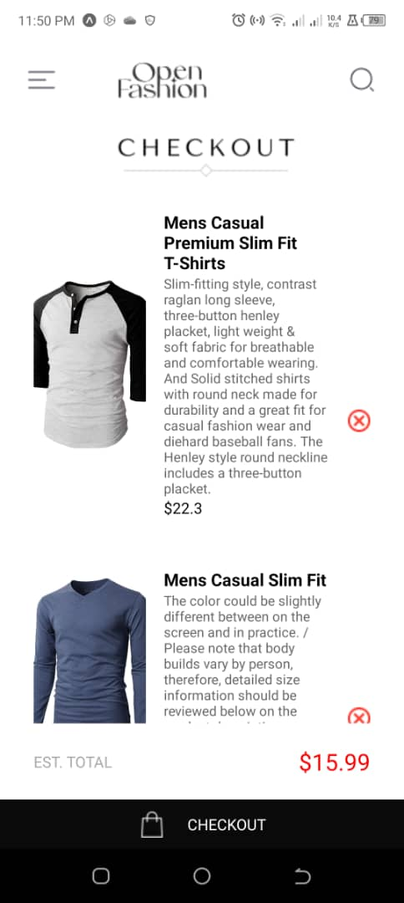
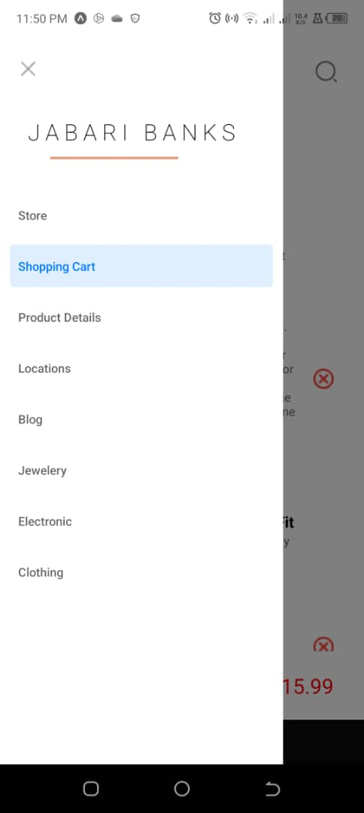
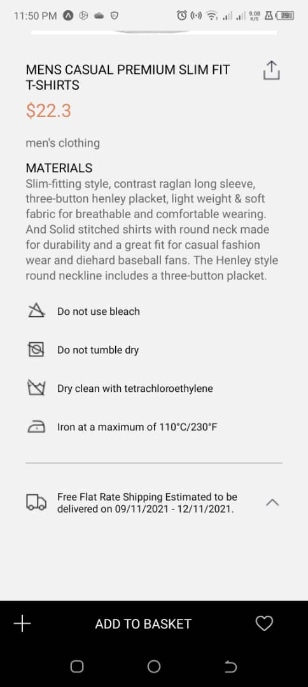

# rn-assignment7-11357610
Working with the Fetch API in Expo

In Addition to Assignment 6,
This repository is to add the following features:
- Fetching the available products data from an external API
- Further Customized Drawer component (apply swipe gesture) too 

The Design is based on the following link: [UI MockUp](https://drive.google.com/file/d/1GBW0tntCgBbtRXyx1k1tFDKLqksS7hpc/view?usp=sharing)

### The Design Choices for this App:
- Will maintain the same design as Assignment 6. 
  - AsyncStorage is used to store the products added to the cart.
  - ContextAPI for state management
  - DrawerNavigator is used for navigation.
- FETCH API is used to fetch the products data.
- ProductDetailScreen will be included also.

### Development Steps:
- Cloned the repository
- Copied the code from Assignment 6
- Installed required modules
- Implemented Fetch API to replace hard coded Data Array
  - Had to Ensure price was a number to handle Nan values, while corresponding to the current logic
  - Had to ensure the product image was a string to handle the image URL.
  - Selected only necessary fields from the API response.
  - Used API id to for unique map values
- ProductDetailScreem
  - Layout
  - Link to Drawer 
  - Link to Homescreen product
  - Used item passed from homescreen for dynamic content
  - Styled
- Drawer
  - Customized Drawer implemented
  - More Screens added but blank
- Testing
  - Checked functionality of buttons and icons(pressables)
  - Checked swiping gesture for app drawer -- done by default
  - run app on expo go android for full experience

### Identified Limits:
- Although there are multiple productS(count >1), users can't add multiple same products to the cart
- Product Details Screen has hard code...not all info comes from the provided API.

### Screenshots of the app on Android

### Running the App
1. Clone the repository: `git clone https://github.com/blip-cmd/rn-assignment7-11357610.git`
2. Install dependencies: `npm install`
3. Start the Expo development server: `npm start`
4. Use the Expo app on your Android device to run the app, or use an Android emulator.

### Corrections
If you have any positive criticism, kindly get in touch. 
Thank you.